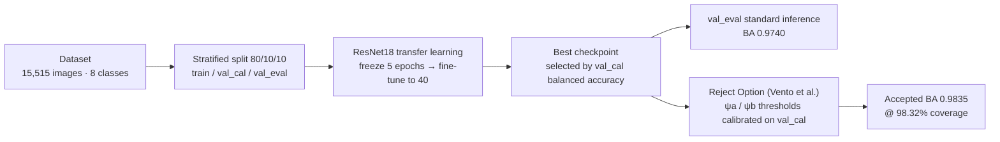

# ♻️ Waste Type Identification

> An 8-class image classifier built on transfer learning: a pretrained **ResNet18** adapted with two-phase fine-tuning, batch-level class balancing and a **Vento-style reject option**, selected by **balanced accuracy**.


---

## 📖 Overview

**Context:** team project (Group 47) for the course *Machine Learning* (2025/26), University of Salerno. The task is **waste type identification**: given an image of a discarded object, predict which of **8 material categories** it belongs to. The work covers the full pipeline, from a documented data split to a rigorous hypothesis-driven experimental plan and a final report.

**The problem:** the dataset is **strongly imbalanced** and several classes are **visually ambiguous**:

| Challenge | Effect |
|---|---|
| Class imbalance (Clothing ≫ Metal/Undifferentiated) | Global accuracy hides poor recall on minority classes |
| Transparent plastic vs. glass | Shared reflections and transparency cause systematic confusion |
| Opaque plastic vs. papery | Similar shape and texture at low resolution |
| Untrained head vs. pretrained backbone | Noisy early gradients can degrade ImageNet features |
| Uncalibrated softmax | Overconfident wrong predictions limit any reject option |

Because the evaluation metric is **balanced accuracy**, the goal is stable recall across *all* eight classes, not just the majority ones.

**The solution:** a ResNet18 pretrained on ImageNet, fine-tuned in two phases with discriminative learning rates, trained with batch-level balancing (`WeightedRandomSampler`) and label smoothing, then wrapped in a **coverage-based reject option** calibrated on a dedicated validation split. The final model reaches **0.9740 balanced accuracy** on the unseen `val_eval` split and **0.9835 accepted balanced accuracy** with rejection, at a 1.68% rejection rate.

### Conceptual pipeline



---

## ✨ Key Features

- **ImageNet transfer learning**: a pretrained `resnet18` provides strong visual features, compatible with Colab GPU memory limits.
- **Two-phase training**: 5 epochs with a **frozen backbone** let the randomly-initialized head adapt, then full fine-tuning until epoch 40.
- **Discriminative learning rates**: `AdamW` with a lower LR for the backbone (`1e-4`) and a higher LR for the head (`5e-4`), plus weight decay `1e-4`.
- **Batch-level imbalance handling**: `WeightedRandomSampler` oversamples minority classes so they appear in enough training batches, on top of class-weighted loss.
- **Class-weighted cross-entropy + label smoothing (α = 0.1)**: larger loss weights for rare classes and better-calibrated softmax outputs.
- **Moderate augmentation**: random resized crop, horizontal flip, small rotation, light color jitter and random erasing — deliberately avoiding aggressive transforms that destroy fine-grained material cues.
- **Coverage-based reject option (Vento et al.)**: reliability scores ψa (max softmax) and ψb (top-2 margin), with τ calibrated by scanning all values on `val_cal` to maximize accepted BA subject to **coverage ≥ 98%**.
- **Leakage-free calibration**: the 20% validation partition is split 50/50 into `val_cal` (threshold calibration) and `val_eval` (evaluation only).
- **Reproducible and documented**: fixed seed (42), a saved `split.csv`, per-experiment `config.json`, `history.csv`, `summary.json` and confusion matrices.
- **A/B test harness**: the provided `test_Computer_Engineering.ipynb` implements the official `load_model` / `predict` contract evaluated on a private test set.

---

## 🧱 Tech Stack & Architecture

### Technologies

| Technology | Role | Why |
|---|---|---|
| **PyTorch 2.x** | Model definition and training loop | Explicit, debuggable control over the two-phase schedule |
| **torchvision** | Pretrained ResNet18 and transforms | Ready-to-use ImageNet weights and augmentation pipeline |
| **scikit-learn** | `balanced_accuracy_score`, `classification_report`, `StratifiedShuffleSplit` | Reference implementations of the required metric and splitting |
| **pandas / NumPy** | Dataset bookkeeping and split management | Clean tabular handling of 15k samples and class statistics |
| **Google Colab (T4)** | Training and evaluation environment | Free GPU with a hard memory budget to respect |
| **Matplotlib** | Training curves and confusion matrices | Visual diagnostics for the report |

### Repository layout

```
.
├── training_gr47.ipynb              # Training + Reject Option pipeline (Colab)
├── test_Computer_Engineering.ipynb  # Official evaluation harness: load_model / predict
├── checkpoint.pth                   # Final ResNet18 state_dict (weights)
├── split.csv                        # Documented 80/10/10 stratified split
├── Report_ML_group47.pdf            # Final Machine Learning report
├── Presentation_Group47.pdf         # Project slide deck
├── team_names.txt                   # Group members
└── README.md
```

The training notebook is organized as a linear, restartable pipeline:

1. **Mount Drive & clone repo** — pull the base branch, create a per-run branch.
2. **Experiment configuration** — constants, class names, label map, seeding.
3. **Dataset & split** — scan folders, build the DataFrame, stratify 80/20 then 50/50, write `split.csv`.
4. **Dataset, transforms & DataLoaders** — `WasteDataset`, train/val transforms, `WeightedRandomSampler`, class weights.
5. **Model** — ResNet18 + dropout/linear head, loss, optimizer, scheduler.
6. **Two-phase training** — freeze then unfreeze, checkpoint on best `val_cal` balanced accuracy.
7. **Reject Option** — calibrate τ on `val_cal`, apply to `val_eval`.
8. **Final metrics & plots** — classification report, confusion matrices, training curves.
9. **Notes & push** — commit results to the run branch.

---

## 🚀 Getting Started

### Prerequisites

- **Python 3.10+** with PyTorch and torchvision
- **scikit-learn**, **pandas**, **NumPy**, **Matplotlib**, **Pillow**
- A **CUDA-capable GPU** (the reference runs use a Colab **T4**)
- The `waste_type_identification` dataset folder/zip (expected at `MyDrive/waste_type_identification` in the Colab setup)

### Installation

```bash
# 1. Clone
git clone https://github.com/fabriziodrr/ProjectML.git
cd ProjectML

# 2. Virtual environment
python -m venv .venv
source .venv/bin/activate        # Windows: .venv\Scripts\activate

# 3. Dependencies
pip install torch torchvision scikit-learn pandas numpy matplotlib pillow
```

### Configuration

All experiment parameters live at the top of `training_gr47.ipynb`:

| Constant | Default | Meaning |
|---|---|---|
| `SEED` | 42 | Global random seed |
| `NUM_CLASSES` | 8 | Output classes |
| `BATCH_SIZE` | 32 | Mini-batch size |
| `VAL_SIZE` | 0.20 | Validation share (then split 50/50) |
| `EPOCHS` / `PATIENCE` | 40 / 8 | Max epochs and early-stopping patience |
| `TWO_PHASE_FREEZE_EPOCHS` | 5 | Frozen-backbone epochs |
| `BACKBONE_LR` / `HEAD_LR` | 1e-4 / 5e-4 | Discriminative learning rates |
| `DROPOUT_P` | 0.25 | Dropout before the linear head |
| `WEIGHT_DECAY` | 1e-4 | AdamW L2 regularization |
| `LABEL_SMOOTHING` | 0.1 | Cross-entropy smoothing |

### Run

```bash
# Training (open in Google Colab and run all cells)
#   - mounts Google Drive
#   - clones the repo with a personal GitHub token
#   - trains, calibrates the reject option and pushes results to a run branch
training_gr47.ipynb
```

> The notebook is written for **Colab** because it mounts Drive and pushes results back to GitHub. The model code itself is framework-standard and runs on any CUDA/CPU machine.

---

## 🧪 Usage

### Training walkthrough

Running `training_gr47.ipynb` end to end produces:

| Artifact | Content |
|---|---|
| `split.csv` | Per-image `relative_path, folder, label, class_name, split` |
| `config.json` | Full experiment configuration |
| `class_weights.csv` | Per-class training counts and loss weights |
| `history.csv` | Per-epoch train/val loss and balanced accuracy (with phase) |
| `summary.json` | Best epoch, best `val_cal` BA, `val_eval` metrics, reject results |
| `classification_report.txt` | Precision/recall/F1 per class on `val_eval` |
| `confusion_matrix.csv/.png` | Raw and normalized confusion matrices |
| `training_curves.png` | Loss and balanced-accuracy curves across both phases |
| `resnet18_exnovo_v324_best.pth` | Best checkpoint (state_dict + class names + config) |

### Programmatic inference

The evaluation notebook defines the exact contract expected by the private test set:

```python
from test_Computer_Engineering import load_model, predict
import numpy as np

model = load_model()                                   # loads ./checkpoint.pth

# X: uint8 numpy array, shape (batch_size, rows, cols, 3)
X = np.random.randint(0, 255, size=(2, 256, 256, 3), dtype=np.uint8)
y = predict(model, X)                                   # -> uint8 array (batch_size, 1)
assert y.shape == (2, 1) and y.dtype == np.uint8 and (y < 8).all()
```

The `predict` function re-implements the validation preprocessing in pure NumPy/PyTorch: RGB conversion, `0..1` scaling, bilinear resize to 256, center crop to 224, ImageNet normalization, forward pass and `argmax`.

### Evaluation

To evaluate on a local folder, create an `eval/` directory next to `test_Computer_Engineering.ipynb` containing the test images and run the notebook:

```bash
mkdir eval          # put the test images here
# then run all cells; predictions are saved to predictions.npy
```

---

## 📊 Results

### Model evolution

| Version | Main change | Balanced accuracy | Outcome |
|---|---|---|---|
| **Baseline** | ResNet18, full fine-tuning, uniform LR | 0.9487 | Strong start, weak on Metal/Plastic |
| **Regularized** | Discriminative LRs, dropout, stronger aug. | 0.9591 | Better rare-class behavior |
| **Batch-Balanced** | `WeightedRandomSampler`, label smoothing | 0.9725 | Best single-phase classifier |
| **Final (v3.2.7)** | Two-phase, moderate aug, reject ≥98% | **0.9740** | Final delivered model |
| **Cross-Validation** | 3-fold CV, reduced budget | 0.9495 ± 0.0019 | Robustness confirmed |

### Final classifier (`Final`) on `val_eval`

| Metric | Value |
|---|---|
| Best epoch | 40 (phase: finetune) |
| Validation BA (`val_cal`, best) | 0.9754 |
| Validation BA (`val_eval`, no reject) | **0.9740** |
| Validation accuracy (`val_eval`) | 0.9781 |
| Train/val gap | 2.39% |
| Macro precision / recall / F1 | 0.97 / 0.97 / 0.97 |
| Weighted precision / recall / F1 | 0.98 / 0.98 / 0.98 |
| Evaluated samples | 1,552 |

| Class | Support | Precision | Recall | F1 |
|---|---|---|---|---|
| Battery | 95 | 0.98 | 1.00 | 0.99 |
| Clothing | 731 | 0.99 | 0.99 | 0.99 |
| Glass | 201 | 0.97 | 0.97 | 0.97 |
| Metal | 77 | 0.94 | 1.00 | 0.97 |
| Organic | 99 | 0.96 | 0.98 | 0.97 |
| Papery | 194 | 0.96 | 0.96 | 0.96 |
| Plastic | 86 | 0.96 | 0.90 | 0.93 |
| Undifferentiated | 69 | 0.97 | 1.00 | 0.99 |

### Reject option (`Final`)

| Method | τ | Coverage | Reject | Accuracy | BA | Errors avoided |
|---|---|---|---|---|---|---|
| No reject | – | 100.00% | 0.00% | 97.81% | 97.40% | 0 |
| **ψa (softmax)** | 0.4288 | 98.32% | 1.68% | 98.56% | **98.35%** | 12 |
| ψb (margin) | 0.1409 | 98.90% | 1.10% | 98.31% | 98.00% | 8 |

The **ψa** confidence rule gives the best trade-off: it reduces residual errors from 36 to 24 while rejecting fewer than 2% of samples.

### Cross-validation robustness check

| Fold | Best epoch | Phase | Balanced accuracy |
|---|---|---|---|
| 0 | 14 | finetune | 0.9478 |
| 1 | 10 | finetune | 0.9486 |
| 2 | 7 | finetune | 0.9521 |
| **Mean ± std** | – | – | **0.9495 ± 0.0019** |

The std of `0.0019` shows the pipeline's balanced accuracy varies by at most ~0.4% across partitions, confirming the 80/20 result is stable and not split-dependent.

---

## 🧠 Technical Decisions & Challenges

The experimental plan was built around explicit hypotheses about the expected failure modes. Each experiment isolated one variable.

**1. Two-phase training instead of naive fine-tuning.**
Freezing the backbone for the first 5 epochs prevents the untrained head's noisy gradients from degrading ImageNet features. Combined with refinements, this lifted the reference classifier from 0.9725 to 0.9740 BA.

**2. Discriminative learning rates.**
The pretrained backbone should change conservatively (`1e-4`) while the randomly-initialized head adapts quickly (`5e-4`). This alone improved rare-class recall (Metal 0.88 → 0.92, Plastic 0.89 → 0.92).

**3. Imbalance handled at the batch level, not only in the loss.**
Class weights alone are insufficient: rare classes still appear in fewer batches. Adding `WeightedRandomSampler` was the methodological turning point (0.9487 → 0.9725).

**4. Label smoothing 0.10, not 0.15.**
Smoothing improves calibration for the reject option, but a higher value (0.15) over-regularizes the loss, triggers early stopping at epoch 12 and degrades base BA (0.9701 → 0.9693) and Metal precision (0.92 → 0.83).

**5. Moderate augmentation beats strong augmentation.**
Aggressive transforms (scale 0.70, rotation ±15°, affine shear, erasing 25%) reduced the train/val gap but destroyed fine-grained cues: Metal precision collapsed (0.94 → 0.82), reject rate doubled (2.5% → 5.3%) and overall BA dropped. On visually ambiguous materials, moderate augmentation is optimal.

**6. Coverage-based reject option instead of cost functions.**
Following Vento et al., τ is chosen by scanning all unique ψ values on `val_cal` and maximizing accepted balanced accuracy subject to `coverage ≥ 98%`. This is entirely data-driven — no arbitrary cost parameters — and the resulting threshold is applied to the untouched `val_eval` split.

**7. ψa outperforms ψb.**
The max-softmax rule beats the top-2 margin, suggesting uncertain predictions are mostly single-class low confidence rather than confusion between two specific classes.

**8. Alternatives tested and discarded.**
A 3-epoch freeze (`Short-Freeze`) was insufficient to stabilize the head (−5 points); `ResNet34` (0.9626) and `SGD` (0.9576) underperformed, confirming the bottleneck is data imbalance and class ambiguity, not architecture capacity.

### Hypothesis-to-mechanism map

| Hypothesis | Mechanism | Outcome |
|---|---|---|
| Pretrained CNN is a strong baseline | Full fine-tuning, uniform LR | 0.9487 |
| Discriminative LRs help rare classes | AdamW param groups + dropout | 0.9591 |
| Imbalance must be handled at batch level | `WeightedRandomSampler` + label smoothing | 0.9725 |
| Two-phase protects the backbone | Freeze 5 → fine-tune | 0.9740 |
| Strong augmentation over-regularizes | Moderate transforms only | kept |
| Higher label smoothing weakens supervision | LS = 0.10 | kept |
| Uncertainty can be filtered | Vento reject, coverage ≥ 98% | 0.9835 accepted BA |

### ⚠️ Known limitations

- **Plastic remains the hardest class** (recall 0.90): transparent plastic shares reflections with glass and opaque plastic shares texture with papery. Stronger augmentation and deeper models did not resolve it — it is an intrinsic dataset ambiguity.
- **The cross-validation result is a lower bound**, not a peak: folds train on ~34% fewer samples and a reduced 15-epoch budget. It confirms stability, not absolute performance.
- **The 80/20 split was chosen over k-fold** to maximize training data for minority classes (e.g. Metal has only ~154 images in total).
- **Training used FP32 only** (no mixed precision), constrained by the Colab T4 memory budget (<5 GB training, <4 GB inference).
- **A single seed** was trained for the final model; an ensemble over multiple seeds is left as future work.

---

## 🤝 Contributing & Contact

This is an academic project, but feedback and suggestions are welcome:

1. Fork the repo and create a feature branch (`git checkout -b feature/your-idea`)
2. Commit with clear messages
3. Open a Pull Request describing the change and its expected effect on balanced accuracy

**Ideas for extension:** manual inspection of low-confidence Plastic errors, multi-seed ensembling, mixed-precision training for larger budgets, and additional modalities (e.g. depth or hyperspectral) to disambiguate transparent materials.

---

## 👥 Authors

Group **2026_MLinf_gr47** — Università degli Studi di Salerno, A.A. 2025/2026:

- **Fabrizio D'Errico**
- **Aniello De Girolamo Del Mauro**
- **Manuel De Vivo**

---

<sub>Academic project for educational purposes. Model and results are documented in `Report_ML_group47.pdf`.</sub>
